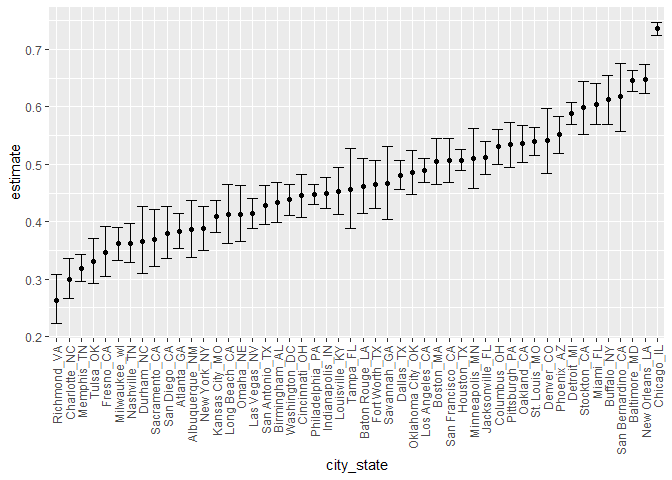
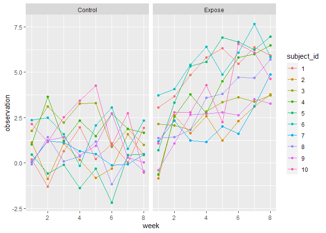

Homework 5
================
Wenhao Gou
2020/11/12

``` r
knitr::opts_chunk$set(
  message = F,
  warning = F
)
library(tidyverse)
```

# Question 1:

## Include and tidy the data:

``` r
homocide <- read_csv("Dataset/homicide_data/homicide-data.csv")
homocide
```

    ## # A tibble: 52,179 x 12
    ##    uid   reported_date victim_last victim_first victim_race victim_age
    ##    <chr>         <dbl> <chr>       <chr>        <chr>       <chr>     
    ##  1 Alb-~      20100504 GARCIA      JUAN         Hispanic    78        
    ##  2 Alb-~      20100216 MONTOYA     CAMERON      Hispanic    17        
    ##  3 Alb-~      20100601 SATTERFIELD VIVIANA      White       15        
    ##  4 Alb-~      20100101 MENDIOLA    CARLOS       Hispanic    32        
    ##  5 Alb-~      20100102 MULA        VIVIAN       White       72        
    ##  6 Alb-~      20100126 BOOK        GERALDINE    White       91        
    ##  7 Alb-~      20100127 MALDONADO   DAVID        Hispanic    52        
    ##  8 Alb-~      20100127 MALDONADO   CONNIE       Hispanic    52        
    ##  9 Alb-~      20100130 MARTIN-LEY~ GUSTAVO      White       56        
    ## 10 Alb-~      20100210 HERRERA     ISRAEL       Hispanic    43        
    ## # ... with 52,169 more rows, and 6 more variables: victim_sex <chr>,
    ## #   city <chr>, state <chr>, lat <dbl>, lon <dbl>, disposition <chr>

The dataset have 52,179 rows and 12 columns. There are 10 variables in
the dataset:

  - `uid`: a character indicate the id of the case

  - `reported_date`: a number indicate the date of the case.

  - `victim_last` to `victim_sex`: indicate the information of the
    victim (first and last name, race, age and sex). All of these
    variables are character.

  - `city` and `state`: two character indicate the location of the case

  - `lat` and `lon`: two number indicate the latitude and longitude of
    the location

  - `disposition` : a character indicate the disposition of the case

Next, we want to create a `city_state` variable (e.g. “Baltimore, MD”)
and then summarize within cities to obtain the total number of homicides
and the number of unsolved homicides (those for which the disposition is
“Closed without arrest” or “Open/No arrest”)

``` r
homocide <- 
  homocide %>% 
  mutate(city_state = str_c(city, state, sep = "_")) %>% 
  mutate(result = case_when(
      disposition == "Closed without arrest" ~ "unsolved",
      disposition == "Open/No arrest"        ~ "unsolved",
      disposition == "Closed by arrest"      ~ "solved",
    )) 
homocide_summary <-
  homocide %>% 
  select(city_state, result) %>% 
  group_by(city_state) %>% 
  summarise(
    total_case = n(),
    total_unsolved = sum(result == "unsolved")
  )
homocide_summary
```

    ## # A tibble: 51 x 3
    ##    city_state     total_case total_unsolved
    ##    <chr>               <int>          <int>
    ##  1 Albuquerque_NM        378            146
    ##  2 Atlanta_GA            973            373
    ##  3 Baltimore_MD         2827           1825
    ##  4 Baton Rouge_LA        424            196
    ##  5 Birmingham_AL         800            347
    ##  6 Boston_MA             614            310
    ##  7 Buffalo_NY            521            319
    ##  8 Charlotte_NC          687            206
    ##  9 Chicago_IL           5535           4073
    ## 10 Cincinnati_OH         694            309
    ## # ... with 41 more rows

## Proportion test on Baltimore\_MD

We can firstly define a function to do all the jobs:

``` r
prop_test_ <- function(tibble_input){
  tibble_output <-
    tibble_input %>% 
    mutate(proptest = 
              map2(
                .x = pull(tibble_input, total_unsolved),
                .y = pull(tibble_input, total_case),
                ~prop.test(x = .x, n = .y))) %>% 
    mutate(tidytest = 
             map(
               .x = proptest, 
               ~broom::tidy(.x))) %>% 
    select(-proptest) %>% 
    unnest(tidytest) %>% 
    select(city_state, estimate, conf.low, conf.high)
  return(tibble_output)
}
```

Then, for Baltimore, MD

``` r
homocide_summary %>%
  filter(city_state == "Baltimore_MD") %>%
  prop_test_(.) 
```

    ## # A tibble: 1 x 4
    ##   city_state   estimate conf.low conf.high
    ##   <chr>           <dbl>    <dbl>     <dbl>
    ## 1 Baltimore_MD    0.646    0.628     0.663

## Run the test for all the city:

``` r
homocide_result <-
  homocide_summary %>% 
  prop_test_(.)
homocide_result
```

    ## # A tibble: 51 x 4
    ##    city_state     estimate conf.low conf.high
    ##    <chr>             <dbl>    <dbl>     <dbl>
    ##  1 Albuquerque_NM    0.386    0.337     0.438
    ##  2 Atlanta_GA        0.383    0.353     0.415
    ##  3 Baltimore_MD      0.646    0.628     0.663
    ##  4 Baton Rouge_LA    0.462    0.414     0.511
    ##  5 Birmingham_AL     0.434    0.399     0.469
    ##  6 Boston_MA         0.505    0.465     0.545
    ##  7 Buffalo_NY        0.612    0.569     0.654
    ##  8 Charlotte_NC      0.300    0.266     0.336
    ##  9 Chicago_IL        0.736    0.724     0.747
    ## 10 Cincinnati_OH     0.445    0.408     0.483
    ## # ... with 41 more rows

## The plot:

``` r
homocide_result %>% 
  mutate(city_state = fct_reorder(city_state, estimate)) %>% 
  filter(city_state != "Tulsa_AL") %>%   #Poor data with just 1 case
  ggplot(aes(x = city_state, y = estimate)) +
  geom_point() + 
  geom_errorbar(aes(ymin = conf.low, ymax = conf.high)) + 
  theme(axis.text.x = element_text(angle = 90, vjust = 0.5, hjust = 1))
```

<!-- -->

# Question 2:

## Read and tidy the data:

We can read the data by maps:

``` r
study_data <- 
  tibble(
    names = list.files("Dataset/lda_data")) %>% 
  mutate(file_names = str_c("Dataset/lda_data/" , names)) %>% 
  mutate(content = map(.x = file_names, ~read_csv(.x))) %>% 
  unnest(content) %>% 
  select(-file_names)
study_data
```

    ## # A tibble: 20 x 9
    ##    names      week_1 week_2 week_3 week_4 week_5 week_6 week_7 week_8
    ##    <chr>       <dbl>  <dbl>  <dbl>  <dbl>  <dbl>  <dbl>  <dbl>  <dbl>
    ##  1 con_01.csv   0.2  -1.31    0.66   1.96   0.23   1.09   0.05   1.94
    ##  2 con_02.csv   1.13 -0.88    1.07   0.17  -0.83  -0.31   1.58   0.44
    ##  3 con_03.csv   1.77  3.11    2.22   3.26   3.31   0.89   1.88   1.01
    ##  4 con_04.csv   1.04  3.66    1.22   2.33   1.47   2.7    1.87   1.66
    ##  5 con_05.csv   0.47 -0.580  -0.09  -1.37  -0.32  -2.17   0.45   0.48
    ##  6 con_06.csv   2.37  2.5     1.59  -0.16   2.08   3.07   0.78   2.35
    ##  7 con_07.csv   0.03  1.21    1.13   0.64   0.49  -0.12  -0.07   0.46
    ##  8 con_08.csv  -0.08  1.42    0.09   0.36   1.18  -1.16   0.33  -0.44
    ##  9 con_09.csv   0.08  1.24    1.44   0.41   0.95   2.75   0.3    0.03
    ## 10 con_10.csv   2.14  1.15    2.52   3.44   4.26   0.97   2.73  -0.53
    ## 11 exp_01.csv   3.05  3.67    4.84   5.8    6.33   5.46   6.38   5.91
    ## 12 exp_02.csv  -0.84  2.63    1.64   2.58   1.24   2.32   3.11   3.78
    ## 13 exp_03.csv   2.15  2.08    1.82   2.84   3.36   3.61   3.37   3.74
    ## 14 exp_04.csv  -0.62  2.54    3.78   2.73   4.49   5.82   6      6.49
    ## 15 exp_05.csv   0.7   3.33    5.34   5.57   6.9    6.66   6.24   6.95
    ## 16 exp_06.csv   3.73  4.08    5.4    6.41   4.87   6.09   7.66   5.83
    ## 17 exp_07.csv   1.18  2.35    1.23   1.17   2.02   1.61   3.13   4.88
    ## 18 exp_08.csv   1.37  1.43    1.84   3.6    3.8    4.72   4.68   5.7 
    ## 19 exp_09.csv  -0.4   1.08    2.66   2.7    2.8    2.64   3.51   3.27
    ## 20 exp_10.csv   1.09  2.8     2.8    4.3    2.25   6.57   6.09   4.64

Next, we need to tidy the dataset:

``` r
study_data_tidy <-
  study_data %>% 
  separate(names,
           into = c("arm","subject_id"),
           sep = "_") %>% 
  mutate(arm = case_when(
    arm == "con" ~ "Control",
    arm == "exp" ~ "Expose"
  )) %>% 
  mutate(subject_id = str_extract(subject_id, "^\\d{2}")) %>% 
  mutate(subject_id = as.numeric(subject_id)) %>% 
  pivot_longer(week_1:week_8,
               names_to = "week",
               values_to = "observation",
               names_prefix = "week_") %>% 
  mutate(week = as.numeric(week))
study_data_tidy
```

    ## # A tibble: 160 x 4
    ##    arm     subject_id  week observation
    ##    <chr>        <dbl> <dbl>       <dbl>
    ##  1 Control          1     1        0.2 
    ##  2 Control          1     2       -1.31
    ##  3 Control          1     3        0.66
    ##  4 Control          1     4        1.96
    ##  5 Control          1     5        0.23
    ##  6 Control          1     6        1.09
    ##  7 Control          1     7        0.05
    ##  8 Control          1     8        1.94
    ##  9 Control          2     1        1.13
    ## 10 Control          2     2       -0.88
    ## # ... with 150 more rows

## Spaghetti plot

``` r
study_data_tidy %>%
  mutate(subject_id = as.factor(subject_id)) %>% 
  ggplot(aes(x = week, y = observation, color = subject_id)) +
  geom_point() +
  geom_line() +
  facet_grid(~arm)
```

<!-- -->

From the plot, we can see that, there are different pattern between the
control group and the expose group. For the control group, the
observation tend to be fluctuate around 1.25 for 8 weeks. For the expose
group, there is an increasing trend of the observation over time.

# Question 3:
