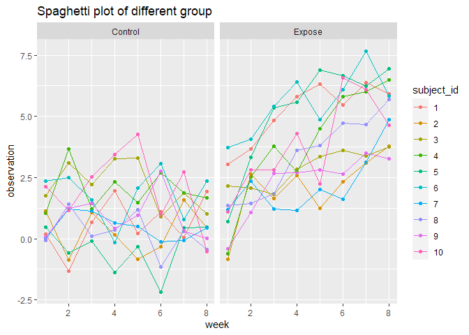
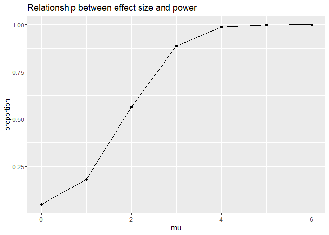

Homework 5
================
Wenhao Gou
2020/11/12

``` r
knitr::opts_chunk$set(
  message = F,
  warning = F
)
library(tidyverse)
```

# Question 1:

## Include and tidy the data:

``` r
homocide <- read_csv("Dataset/homicide_data/homicide-data.csv")
homocide
```

    ## # A tibble: 52,179 x 12
    ##    uid   reported_date victim_last victim_first victim_race victim_age
    ##    <chr>         <dbl> <chr>       <chr>        <chr>       <chr>     
    ##  1 Alb-~      20100504 GARCIA      JUAN         Hispanic    78        
    ##  2 Alb-~      20100216 MONTOYA     CAMERON      Hispanic    17        
    ##  3 Alb-~      20100601 SATTERFIELD VIVIANA      White       15        
    ##  4 Alb-~      20100101 MENDIOLA    CARLOS       Hispanic    32        
    ##  5 Alb-~      20100102 MULA        VIVIAN       White       72        
    ##  6 Alb-~      20100126 BOOK        GERALDINE    White       91        
    ##  7 Alb-~      20100127 MALDONADO   DAVID        Hispanic    52        
    ##  8 Alb-~      20100127 MALDONADO   CONNIE       Hispanic    52        
    ##  9 Alb-~      20100130 MARTIN-LEY~ GUSTAVO      White       56        
    ## 10 Alb-~      20100210 HERRERA     ISRAEL       Hispanic    43        
    ## # ... with 52,169 more rows, and 6 more variables: victim_sex <chr>,
    ## #   city <chr>, state <chr>, lat <dbl>, lon <dbl>, disposition <chr>

The dataset have 52,179 rows and 12 columns. There are 10 variables in
the dataset:

  - `uid`: a character indicate the id of the case

  - `reported_date`: a number indicate the date of the case.

  - `victim_last` to `victim_sex`: indicate the information of the
    victim (first and last name, race, age and sex). All of these
    variables are character.

  - `city` and `state`: two character indicate the location of the case

  - `lat` and `lon`: two number indicate the latitude and longitude of
    the location

  - `disposition` : a character indicate the disposition of the case

Next, we want to create a `city_state` variable (e.g. “Baltimore, MD”)
and then summarize within cities to obtain the total number of homicides
and the number of unsolved homicides (those for which the disposition is
“Closed without arrest” or “Open/No arrest”)

``` r
homocide <- 
  homocide %>% 
  mutate(city_state = str_c(city, state, sep = "_")) %>% 
  mutate(result = case_when(
      disposition == "Closed without arrest" ~ "unsolved",
      disposition == "Open/No arrest"        ~ "unsolved",
      disposition == "Closed by arrest"      ~ "solved",
    )) 
homocide_summary <-
  homocide %>% 
  select(city_state, result) %>% 
  group_by(city_state) %>% 
  summarise(
    total_case = n(),
    total_unsolved = sum(result == "unsolved")
  )
homocide_summary
```

    ## # A tibble: 51 x 3
    ##    city_state     total_case total_unsolved
    ##    <chr>               <int>          <int>
    ##  1 Albuquerque_NM        378            146
    ##  2 Atlanta_GA            973            373
    ##  3 Baltimore_MD         2827           1825
    ##  4 Baton Rouge_LA        424            196
    ##  5 Birmingham_AL         800            347
    ##  6 Boston_MA             614            310
    ##  7 Buffalo_NY            521            319
    ##  8 Charlotte_NC          687            206
    ##  9 Chicago_IL           5535           4073
    ## 10 Cincinnati_OH         694            309
    ## # ... with 41 more rows

## Proportion test on Baltimore\_MD

We can firstly define a function to do all the jobs:

``` r
prop_test_ <- function(tibble_input){
  tibble_output <-
    tibble_input %>% 
    mutate(proptest = 
              map2(
                .x = pull(tibble_input, total_unsolved),
                .y = pull(tibble_input, total_case),
                ~prop.test(x = .x, n = .y))) %>% 
    mutate(tidytest = 
             map(
               .x = proptest, 
               ~broom::tidy(.x))) %>% 
    select(-proptest) %>% 
    unnest(tidytest) %>% 
    select(city_state, estimate, conf.low, conf.high)
  return(tibble_output)
}
```

Then, for Baltimore, MD

``` r
homocide_summary %>%
  filter(city_state == "Baltimore_MD") %>%
  prop_test_(.) 
```

    ## # A tibble: 1 x 4
    ##   city_state   estimate conf.low conf.high
    ##   <chr>           <dbl>    <dbl>     <dbl>
    ## 1 Baltimore_MD    0.646    0.628     0.663

## Run the test for all the city:

``` r
homocide_result <-
  homocide_summary %>% 
  prop_test_(.)
homocide_result
```

    ## # A tibble: 51 x 4
    ##    city_state     estimate conf.low conf.high
    ##    <chr>             <dbl>    <dbl>     <dbl>
    ##  1 Albuquerque_NM    0.386    0.337     0.438
    ##  2 Atlanta_GA        0.383    0.353     0.415
    ##  3 Baltimore_MD      0.646    0.628     0.663
    ##  4 Baton Rouge_LA    0.462    0.414     0.511
    ##  5 Birmingham_AL     0.434    0.399     0.469
    ##  6 Boston_MA         0.505    0.465     0.545
    ##  7 Buffalo_NY        0.612    0.569     0.654
    ##  8 Charlotte_NC      0.300    0.266     0.336
    ##  9 Chicago_IL        0.736    0.724     0.747
    ## 10 Cincinnati_OH     0.445    0.408     0.483
    ## # ... with 41 more rows

## The plot:

``` r
homocide_result %>% 
  mutate(city_state = fct_reorder(city_state, estimate)) %>% 
  filter(city_state != "Tulsa_AL") %>%   #Poor data with just 1 case
  ggplot(aes(x = city_state, y = estimate)) +
  geom_point() + 
  geom_errorbar(aes(ymin = conf.low, ymax = conf.high)) + 
  theme(axis.text.x = element_text(angle = 90, vjust = 0.5, hjust = 1))
```

<!-- -->

# Question 2:

## Read and tidy the data:

We can read the data by maps:

``` r
study_data <- 
  tibble(
    names = list.files("Dataset/lda_data")) %>% 
  mutate(file_names = str_c("Dataset/lda_data/" , names)) %>% 
  mutate(content = map(.x = file_names, ~read_csv(.x))) %>% 
  select(-file_names)
study_data
```

    ## # A tibble: 20 x 2
    ##    names      content         
    ##    <chr>      <list>          
    ##  1 con_01.csv <tibble [1 x 8]>
    ##  2 con_02.csv <tibble [1 x 8]>
    ##  3 con_03.csv <tibble [1 x 8]>
    ##  4 con_04.csv <tibble [1 x 8]>
    ##  5 con_05.csv <tibble [1 x 8]>
    ##  6 con_06.csv <tibble [1 x 8]>
    ##  7 con_07.csv <tibble [1 x 8]>
    ##  8 con_08.csv <tibble [1 x 8]>
    ##  9 con_09.csv <tibble [1 x 8]>
    ## 10 con_10.csv <tibble [1 x 8]>
    ## 11 exp_01.csv <tibble [1 x 8]>
    ## 12 exp_02.csv <tibble [1 x 8]>
    ## 13 exp_03.csv <tibble [1 x 8]>
    ## 14 exp_04.csv <tibble [1 x 8]>
    ## 15 exp_05.csv <tibble [1 x 8]>
    ## 16 exp_06.csv <tibble [1 x 8]>
    ## 17 exp_07.csv <tibble [1 x 8]>
    ## 18 exp_08.csv <tibble [1 x 8]>
    ## 19 exp_09.csv <tibble [1 x 8]>
    ## 20 exp_10.csv <tibble [1 x 8]>

Next, we need to tidy the dataset:

``` r
study_data_tidy <-
  study_data %>%
  unnest(content) %>% 
  separate(names,
           into = c("arm","subject_id"),
           sep = "_") %>% 
  mutate(arm = case_when(
    arm == "con" ~ "Control",
    arm == "exp" ~ "Expose"
  )) %>% 
  mutate(subject_id = str_extract(subject_id, "^\\d{2}")) %>% 
  mutate(subject_id = as.numeric(subject_id)) %>% 
  pivot_longer(week_1:week_8,
               names_to = "week",
               values_to = "observation",
               names_prefix = "week_") %>% 
  mutate(week = as.numeric(week))
study_data_tidy
```

    ## # A tibble: 160 x 4
    ##    arm     subject_id  week observation
    ##    <chr>        <dbl> <dbl>       <dbl>
    ##  1 Control          1     1        0.2 
    ##  2 Control          1     2       -1.31
    ##  3 Control          1     3        0.66
    ##  4 Control          1     4        1.96
    ##  5 Control          1     5        0.23
    ##  6 Control          1     6        1.09
    ##  7 Control          1     7        0.05
    ##  8 Control          1     8        1.94
    ##  9 Control          2     1        1.13
    ## 10 Control          2     2       -0.88
    ## # ... with 150 more rows

## Spaghetti plot

``` r
study_data_tidy %>%
  mutate(subject_id = as.factor(subject_id)) %>% 
  ggplot(aes(x = week, y = observation, color = subject_id)) +
  geom_point() +
  geom_line() +
  facet_grid(~arm) +
  ggtitle("Spaghetti plot of different group")
```

<!-- -->

From the plot, we can see that, there are different pattern between the
control group and the expose group. For the control group, the
observation tend to be fluctuate around 1.25 for 8 weeks. For the expose
group, there is an increasing trend of the observation over time.

# Question 3:

## The main function for the simulation:

``` r
set.seed(429)

simulation_ <- function(mu, sd = 5, sample_size = 30, iteration = 5000){
  df <- 
    tibble(
    sample_id = 1:iteration,
    sample_data = rerun(iteration, rnorm(n = sample_size, mean = mu, sd = sd)))
  df <- 
    df %>% 
    mutate(ttest = map(.x = sample_data, ~t.test(.x, mu = 0))) %>% 
    mutate(ttidy = map(.x = ttest, ~broom::tidy(.x))) %>% 
    select(sample_id, ttidy) %>%
    unnest(ttidy) %>% 
    select(sample_id, estimate, p.value) %>% 
    mutate(decision = case_when(
      p.value < 0.05 ~ "Reject",
      p.value >= 0.05 ~ "Fail to Reject"
    ))
  return(df)
}
```

## Simulation on mean equal to 0:

``` r
simulation_(0)
```

    ## # A tibble: 5,000 x 4
    ##    sample_id estimate p.value decision      
    ##        <int>    <dbl>   <dbl> <chr>         
    ##  1         1    0.180  0.817  Fail to Reject
    ##  2         2    1.32   0.0852 Fail to Reject
    ##  3         3   -0.753  0.379  Fail to Reject
    ##  4         4   -0.906  0.395  Fail to Reject
    ##  5         5    1.36   0.116  Fail to Reject
    ##  6         6    0.365  0.730  Fail to Reject
    ##  7         7    2.22   0.0115 Reject        
    ##  8         8   -1.70   0.0242 Reject        
    ##  9         9    0.473  0.619  Fail to Reject
    ## 10        10    0.407  0.593  Fail to Reject
    ## # ... with 4,990 more rows

## Simulation on multiple means:

``` r
simulation_prop_ <- function(simulation_result){
  output <- 
    simulation_result %>% 
    pull(decision)
  return(sum(output== "Reject")/nrow(simulation_result))
}

Data <- tibble(
  mu = 0:6
)

Data <-
  Data %>% 
  mutate(raw_data = map(.x = mu, ~simulation_(.x))) %>% 
  mutate(proportion = map(.x = raw_data, ~simulation_prop_(.x))) %>% 
  unnest(proportion)
```

## Plots:

### Plot A: Make a plot showing the proportion of times the null was rejected (the power of the test) on the y axis and the true value of on the x axis.

``` r
Data %>% 
  select(-raw_data) %>% 
  ggplot(aes(x = mu, y = proportion)) +
  geom_line() +
  geom_point() +
  ggtitle("Relationship between effect size and power")
```

<!-- -->

Comments:

We can see that as the *mu* increasing, the proportion of rejection will
increasing too. This is because, according to the central limit theorem
(CLT), for a fixed sample size (n = 30 in this case), the distribution
of the sample mean will follow a normal distribution with *mu* = mean we
set and *sd* = *sigma/sqrt(n)*

So, under a fixed significance level, proportion of times the null was
rejected will increase as the peak of the (normal) distribution of
sample mean will moving leftward. This will give a bigger intersection
are with the rejection area of the null hypothesis.

### Plot B: Make a plot showing the average estimate of *mu* on the y axis and the true value of *mu* on the x axis. Make a second plot (or overlay on the first) the average estimate of *mu* only in samples for which the null was rejected on the y axis and the true value of on the x axis

``` r
total_mean_estimation <-
  Data %>% 
  select(-proportion) %>% 
  unnest(raw_data) %>% 
  group_by(mu) %>% 
  summarise(total_mean_est = mean(estimate)) %>% 
  as.tibble()

reject_mean_estimation <-
  Data %>% 
  select(-proportion) %>% 
  unnest(raw_data) %>% 
  group_by(mu, decision) %>% 
  summarise(reject_mean_est = mean(estimate)) %>% 
  filter(decision == "Reject") %>% 
  select(-decision) %>% 
  as_tibble()
  

left_join(total_mean_estimation, reject_mean_estimation) %>% 
  pivot_longer(total_mean_est:reject_mean_est,
               names_to = "group",
               values_to = "estimation") %>% 
  ggplot(aes(x = mu, y = estimation, group = group)) +
  geom_point(aes(color = group)) +
  geom_line(aes(color = group)) +
  ggtitle("Simulation difference among two groups")
```

<!-- -->

Comments:

In general, we can see that as the *mu* increase, the divergent of these
two sets will increase first and be narrower. Also, we notice that the
total mean is approximately equal to the true *mu*. Again, this is
result from CLT and as the *mu* increase, the distribution of sample
mean will follows a normal distribution with increasing *mu* and the
proportion of rejection (H\_0: *mu* = 0) will get bigger. Also, this
reflect the trade-off between the power of the test and the number of
sub-samples in the rejection group (they share the same distribution)
